# University Management System

A comprehensive Java-based desktop application for managing university operations including student and faculty administration, leave management, examination tracking, and fee processing.

## 📋 Table of Contents

- [Features](#features)
- [Project Structure](#project-structure)
- [Prerequisites](#prerequisites)
- [Installation & Setup](#installation--setup)
- [Database Configuration](#database-configuration)
- [Usage](#usage)
- [Class Descriptions](#class-descriptions)
- [Technologies Used](#technologies-used)
- [Default Credentials](#default-credentials)
- [File Structure](#file-structure)
- [Screenshots](#screenshots)

## ✨ Features

### Student Management
- **Add New Students**: Create and register new student information
- **Update Student Details**: Modify existing student records
- **View Student Details**: Display comprehensive student information
- **Student Leave Management**: Apply and track student leave requests
- **View Leave Details**: Monitor student leave history

### Faculty Management
- **Add New Faculty**: Register new teacher/faculty information
- **Update Faculty Details**: Modify existing faculty records
- **View Faculty Details**: Display comprehensive faculty information
- **Faculty Leave Management**: Apply and track faculty leave requests
- **View Leave Details**: Monitor faculty leave history

### Academic Management
- **Enter Marks**: Record student examination marks by semester
- **Examination Results**: View student examination results
- **Subject Management**: Assign subjects to students per semester
- **Fee Structure**: Manage and view fee details for different courses
- **Submit Fees**: Process student fee submissions

### Utilities
- **Calculator**: Built-in calculator utility
- **Notepad**: Text editor utility
- **About Section**: Application information

## 📸 Screenshots

### 1. Login Screen
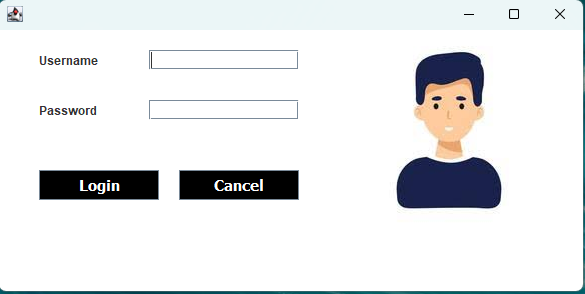

### 2. Start/Splash Screen
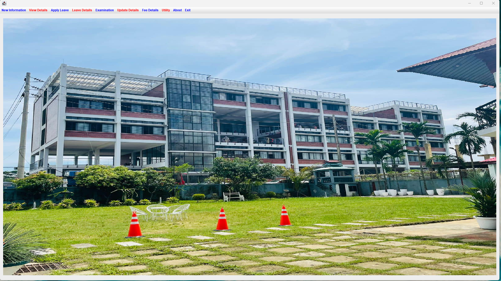

### 3. Add New Student
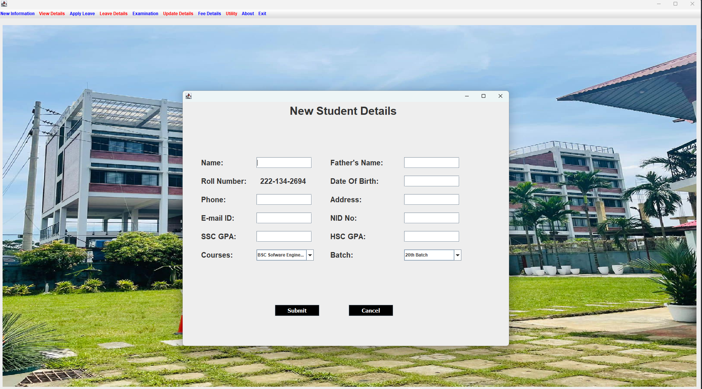

### 4. Student Details


### 5. Update Student Details
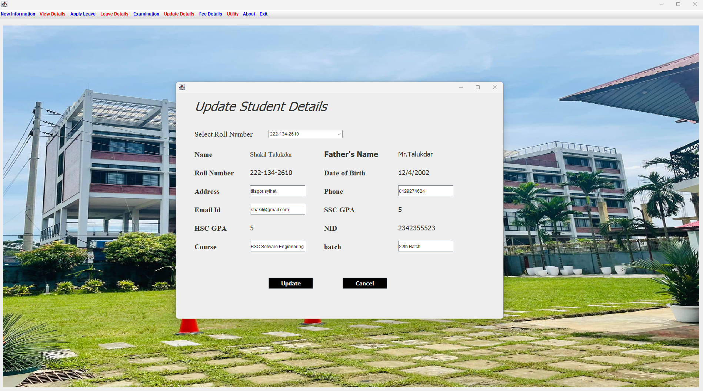

### 6. Student Apply Leave
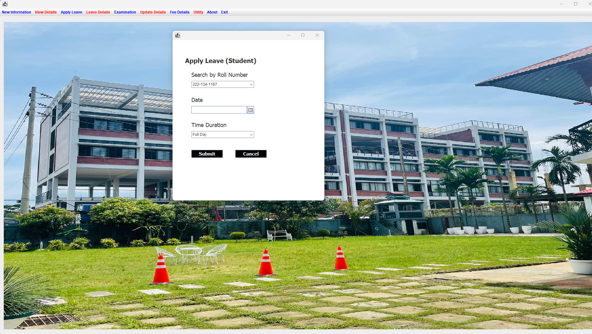

### 7. Student Leave Details
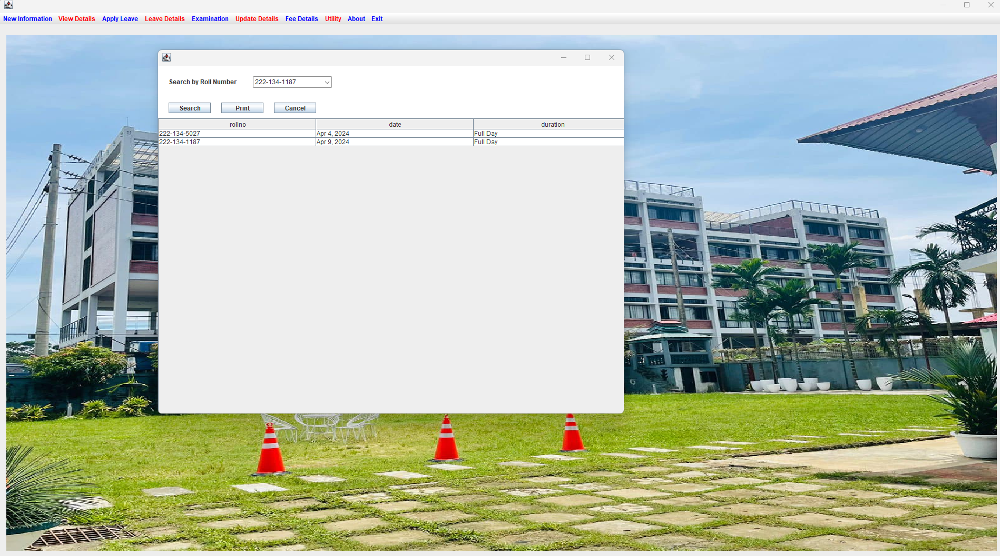

### 8. Add New Teacher/Faculty
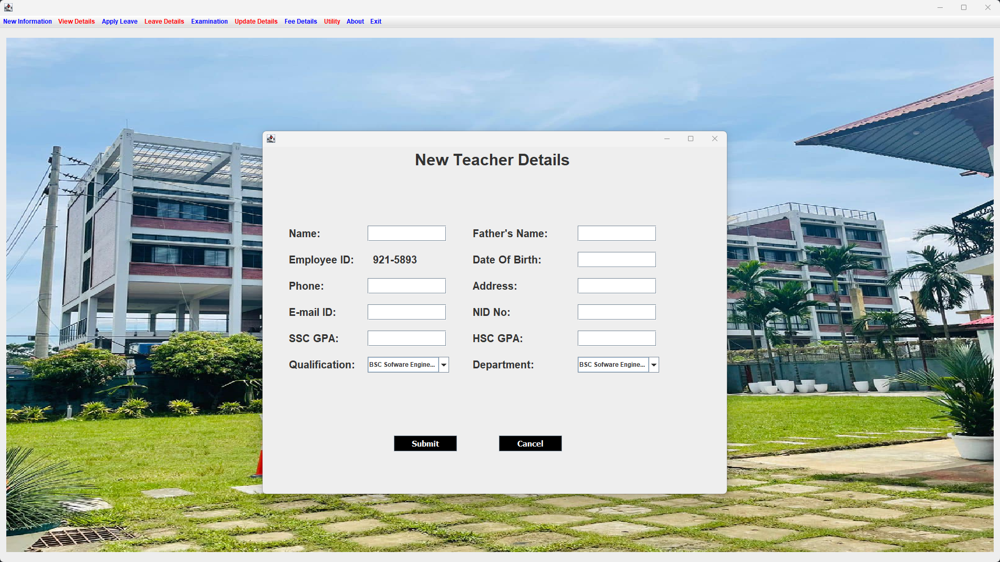

### 9. Employee/Faculty Details


### 10. Update Teacher Details
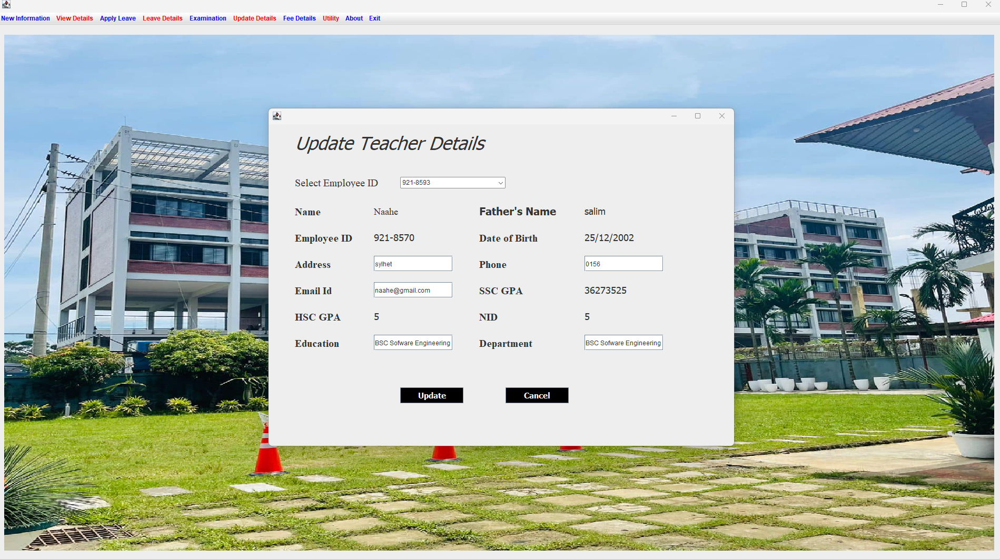

### 11. Teacher Apply Leave
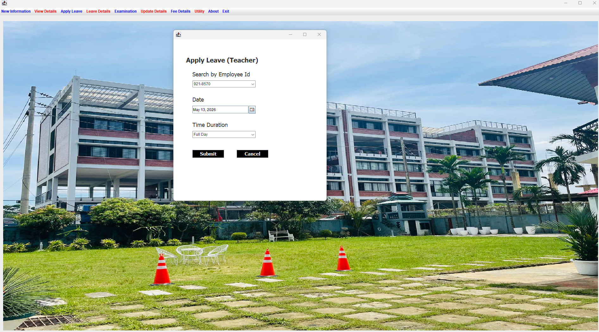

### 12. Faculty Leave Details


### 13. Marks Entry & Updating Page
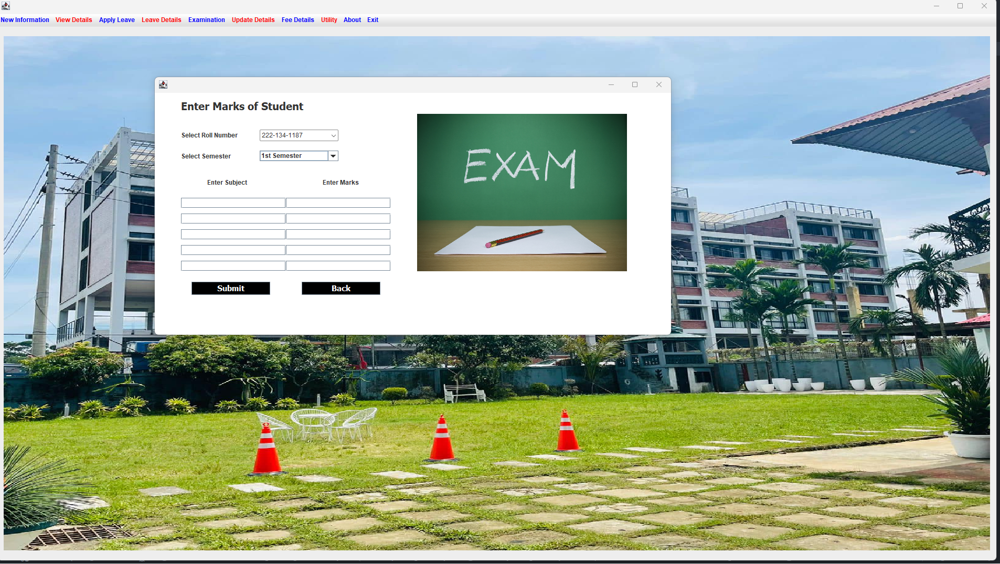

### 14. Check Results
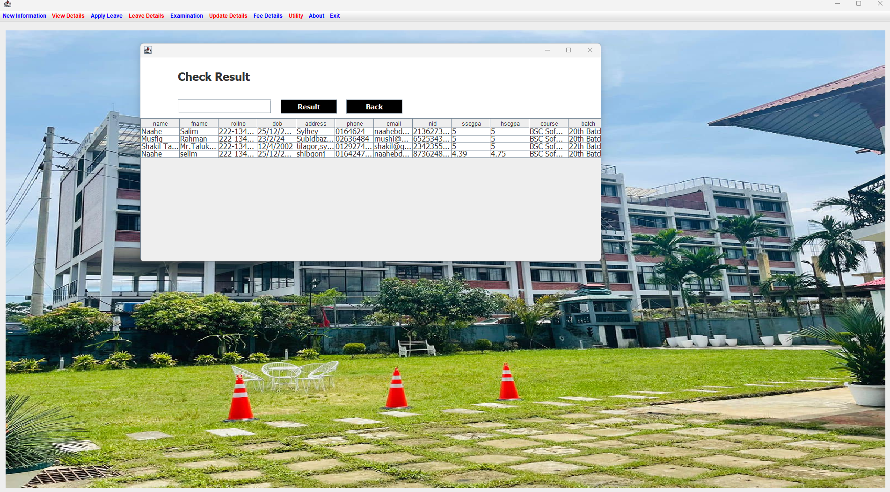

### 15. Display Result Of Student
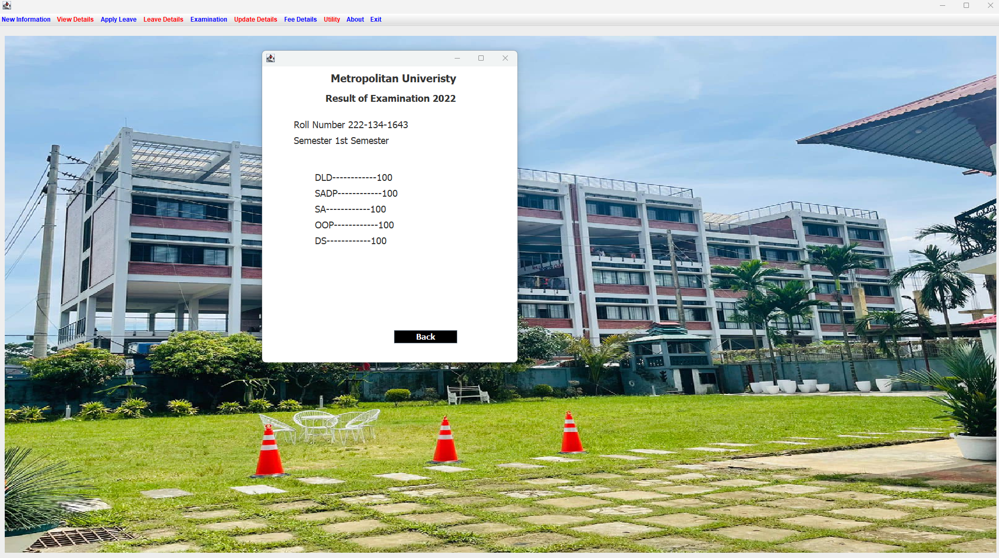

### 16. University Course Fee Structure
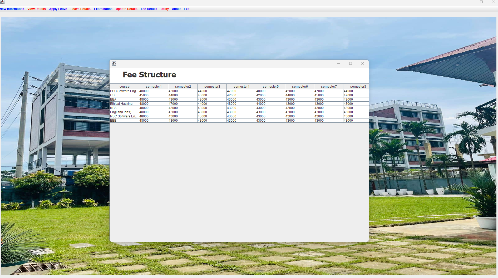

### 17. About Section
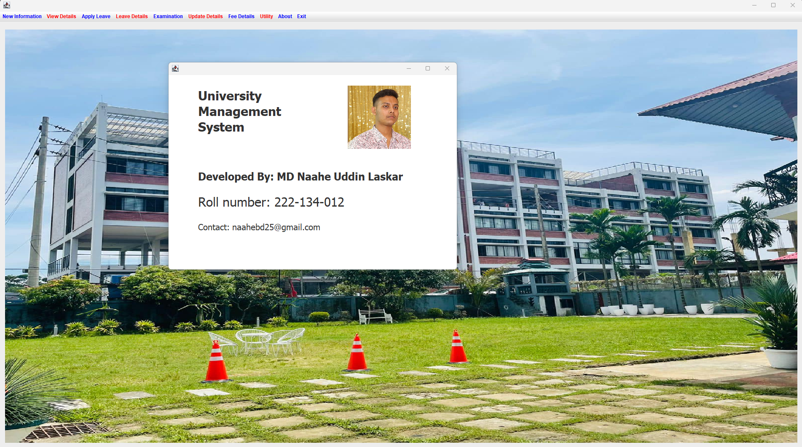

## 📁 Project Structure

```
University_Management_System_Java/
├── Project.java                    # Main application frame & menu
├── Login.java                      # User authentication
├── Conn.java                       # Database connection
│
├── Student Management
│   ├── AddStudent.java             # Add new students
│   ├── StudentDetails.java         # View student information
│   ├── UpdateStudent.java          # Modify student records
│   ├── Marks.java                  # Student marks handling
│   └── EnterMarks.java             # Enter examination marks
│
├── Faculty Management
│   ├── AddTeacher.java             # Add new faculty
│   ├── TeacherDetails.java         # View faculty information
│   ├── UpdateTeacher.java          # Modify faculty records
│   └── Marks.java                  # Faculty-related operations
│
├── Leave Management
│   ├── StudentLeave.java           # Student leave application
│   ├── StudentLeaveDetails.java    # View student leave records
│   ├── TeacherLeave.java           # Faculty leave application
│   └── TeacherLeaveDetails.java    # View faculty leave records
│
├── Academic Management
│   ├── ExaminationDetails.java     # Display examination results
│   └── FeeStructure.java           # Fee information display
│
├── Testing
│   ├── *Test.java files            # Unit tests for each module
│   └── ConnTest.java               # Database connection tests
│
├── UI & Utilities
│   ├── Splash.java                 # Splash screen
│   ├── About.java                  # Application about dialog
│   ├── Icons/                      # Application icons and images
│   └── Jar Files/                  # Required library JAR files
│
├── Database
│   └── universitymanagementsystem.sql  # SQL database schema & sample data
│
└── Configuration
    └── University_Management_System_Java.iml  # IDE configuration
```

## 📋 Prerequisites

- **Java Development Kit (JDK)**: Java 8 or higher
- **MySQL Database**: MySQL 5.7 or higher
- **IDE**: IntelliJ IDEA, Eclipse, or NetBeans (optional)
- **MySQL Connector JAR**: MySQL JDBC driver

## 🔧 Installation & Setup

### Step 1: Clone the Repository
```bash
git clone https://github.com/naahe25/University_Management_System_Java.git
cd University_Management_System_Java
```

### Step 2: Install MySQL Driver
1. Download MySQL Connector Java (mysql-connector-java-8.x.x.jar)
2. Add the JAR file to your project's classpath
3. Place JAR files in the "Jar Files(Add To Referance Library)" directory

### Step 3: Create Database
```bash
mysql -u root -p < universitymanagementsystem.sql
```
Or manually execute the SQL commands in `universitymanagementsystem.sql`

### Step 4: Compile the Project
```bash
javac *.java
```

### Step 5: Run the Application
```bash
java Login
```

## 🗄️ Database Configuration

### Database Details
- **Database Name**: `universitymanagementsystem`
- **Default Username**: `root`
- **Default Password**: (empty)

### Database Tables

| Table | Purpose |
|-------|---------|
| `login` | User authentication credentials |
| `student` | Student information (name, roll no, DOB, contact, etc.) |
| `teacher` | Faculty information (name, emp ID, DOB, contact, etc.) |
| `studentleave` | Student leave records |
| `teacherleave` | Faculty leave records |
| `subject` | Subject assignments per semester |
| `marks` | Student examination marks |
| `fee` | Fee structure for different courses |
| `examination` | Examination information and schedules |

### Supported Courses
- BSC Software Engineering
- CSE (Computer Science Engineering)
- BBA (Bachelor of Business Administration)
- Ethical Hacking
- MBA (Master of Business Administration)
- English (Honours)
- MSC Software Engineering
- EEE (Electrical and Electronics Engineering)

## 🚀 Usage

### Logging In
1. Launch the application: `java Login`
2. Enter credentials:
   - **Username**: `admin`
   - **Password**: `12345`
3. Click "Login" to access the main menu

### Main Menu Navigation
The application provides a menu-driven interface with the following options:

- **New Information**: Add new faculty or student records
- **View Details**: Browse existing faculty and student information
- **Apply Leave**: Submit leave requests for students or faculty
- **Leave Details**: Review leave application history
- **Examination**: View results and enter marks
- **Update Details**: Modify existing records
- **Fee Details**: Check fee structure and submit fees
- **Utility**: Access calculator and notepad
- **About**: View application information
- **Exit**: Close the application

## 📖 Class Descriptions

### Core Classes

**Project.java**
- Main application window
- Implements menu bar with all module navigation
- Handles menu item selection and module launching

**Login.java**
- User authentication interface
- Validates credentials against database
- Launches main Project window on successful login

**Conn.java**
- Database connection utility
- Establishes MySQL connection
- Manages Statement objects for query execution

**Splash.java**
- Application splash screen
- Displays during startup

**About.java**
- Application information dialog
- Displays project details and credits

### Student Management Classes

**AddStudent.java**
- Form for adding new student records
- Collects name, roll number, DOB, address, contact, email, etc.
- Validates and inserts data into database

**StudentDetails.java**
- Displays table of all registered students
- Shows comprehensive student information
- Allows browsing and searching

**UpdateStudent.java**
- Modify existing student information
- Search students by roll number
- Update specific fields

**StudentLeave.java**
- Interface for students to apply for leave
- Records leave date and duration
- Validates and stores in database

**StudentLeaveDetails.java**
- Displays history of student leave applications
- Shows leave status and duration

### Faculty Management Classes

**AddTeacher.java**
- Form for registering new faculty members
- Similar structure to AddStudent
- Stores faculty-specific information

**TeacherDetails.java**
- Displays list of all faculty members
- Shows comprehensive faculty information

**UpdateTeacher.java**
- Modify faculty records by employee ID
- Update specific field values

**TeacherLeave.java**
- Leave application interface for faculty
- Records and stores leave requests

**TeacherLeaveDetails.java**
- Views faculty leave application history

### Academic Management Classes

**Marks.java**
- Handles marks data model
- Manages student exam scores
- Organizes marks by semester and subject

**EnterMarks.java**
- User interface for entering student marks
- Supports multiple subjects per semester
- Validates and stores grades

**ExaminationDetails.java**
- Displays examination schedules and results
- Shows exam dates and course information

**FeeStructure.java**
- Displays fee structure for all courses
- Shows semester-wise fee breakdown

### Test Classes
- **LoginTest.java**: Tests authentication logic
- **AddStudentTest.java**: Tests student addition
- **AddTeacherTest.java**: Tests faculty addition
- **StudentDetailsTest.java**: Tests student data retrieval
- **TeacherDetailsTest.java**: Tests faculty data retrieval
- **ConnTest.java**: Tests database connectivity
- And more... (comprehensive unit test coverage)

## 💻 Technologies Used

- **Language**: Java
- **GUI Framework**: Swing (javax.swing.*)
- **Database**: MySQL
- **Database Driver**: MySQL Connector/J (JDBC)
- **Testing Framework**: JUnit
- **Build Configuration**: IntelliJ IDEA project file (.iml)

## 🔐 Default Credentials

| Field | Value |
|-------|-------|
| Username | admin |
| Password | 12345 |

**Note**: Change default credentials after first login for security purposes.

## 📂 File Structure Details

### Icons Directory
Contains UI images used in the application, including the login screen background and menu icons.

### Jar Files Directory
Store required JAR files here:
- mysql-connector-java-8.x.x.jar (MySQL JDBC driver)
- Add other dependencies as needed

### Compiled Output
- `.class` files are generated in the root directory upon compilation
- Output classes are also stored in the `out/` directory for IDE-based builds

## 🛠️ Troubleshooting

### Database Connection Issues
- Verify MySQL is running
- Check database credentials in `Conn.java`
- Ensure database `universitymanagementsystem` exists
- Confirm MySQL JDBC driver is in classpath

### Application Won't Start
- Ensure Java is properly installed and configured
- Check that all `.java` files are compiled
- Verify no missing dependencies

### GUI Issues
- Ensure Icons folder is in the project root
- Check that image files are correctly named and placed

## 📝 License

This project is open-source and available for educational purposes.

## 👤 Author

**naahe25** - University Management System Java Project

---

**Last Updated**: December 2025

For questions or contributions, feel free to open an issue or submit a pull request!
